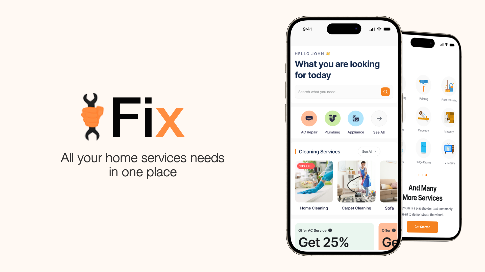
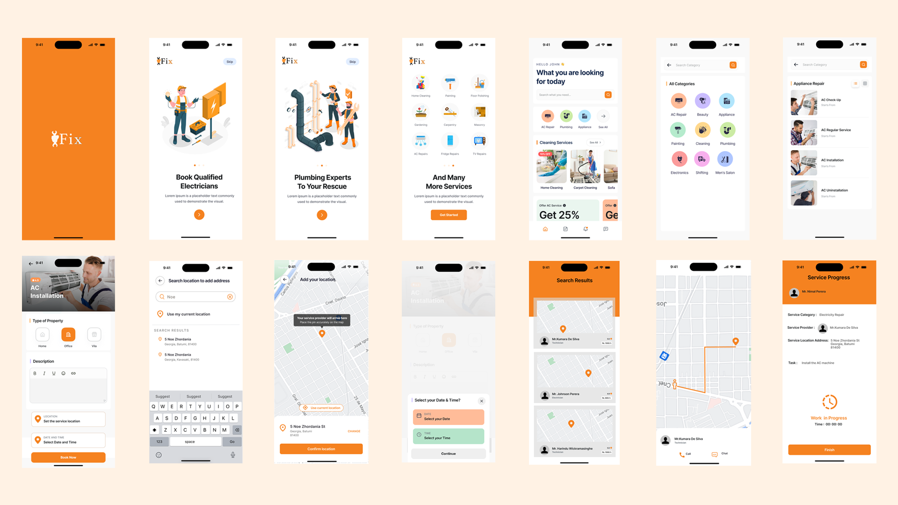

# iFix

## Background

Project repository of team iFix for mSpace Codeblast Hackathon 2023

### Problem statement

In today's fast-paced world, finding skilled professionals for essential household tasks like plumbing, carpentry, and other maintenance work can often be a daunting and time-consuming challenge. Homeowners frequently encounter difficulties in locating reliable and skilled individuals who can efficiently address their specific needs. This issue is further compounded by the lack of a centralized platform that seamlessly connects service seekers with proficient artisans. However, the proposed mobile application aims to revolutionize this process by serving as a comprehensive marketplace. By leveraging the app, users will be able to effortlessly discover and hire experienced professionals for various home improvement tasks. This ultimately simplifies the process and enhances the overall quality of services in the realm of household maintenance.

## Screenshots

## Key Features

The subscribed customers can put open requests for a problem they face. The subscribed service providers can offer those requests with their price. The customers can select a service provider and continue to get their service. Once the customer proceeds, the system provides an interface for the communication between the service provider and customers

- User Profiles: Users create detailed profiles showcasing skills, experience, and past work.
- Service Listings: Skilled workers list services in categories like plumbing, painting, etc.
- Search and Filters: Users find services based on location, ratings, and price.
- Ratings and Reviews: Clients provide feedback on service quality.
- Booking and Scheduling: Clients schedule appointments with skilled workers.
- In-App Chat: Direct messaging for project discussions and estimates.
- Secure Payments: Safe and transparent in-app payment processing.
- Real-Time Tracking: Clients track worker's location en route.
- Service History: Records of past services for accountability.
- Notifications: Updates on bookings, appointments, and responses.
- Multi-Platform Compatibility: Available on iOS and Android.
- Verification and Trust: Verified worker profiles for reliability.
- Emergency Services: Urgent assistance option for critical issues.
- Promotions and Discounts: Offers to boost engagement.
- Customer Support: Reliable help center and in-app chat.
- Language and Localization: Multi-language support for wider reach.

